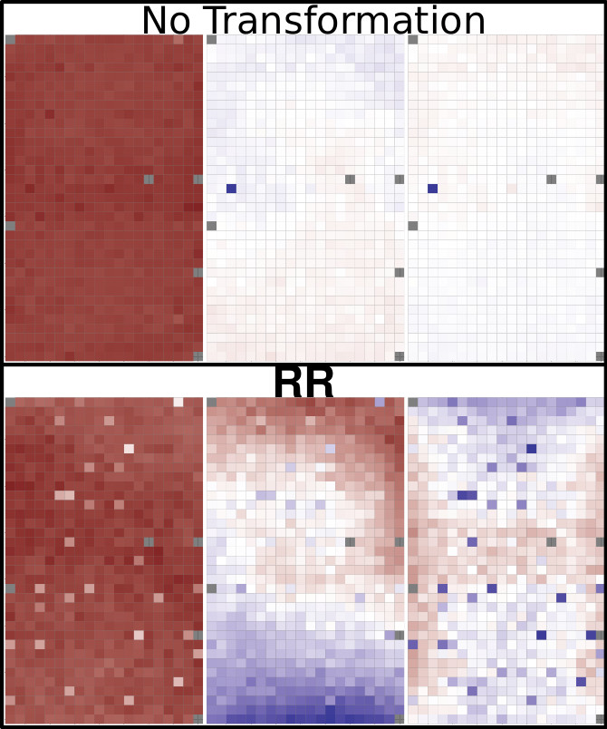

# rr: (R)obust (R)e-scaling to help reveal latent structure. 

The **Robust re-scaling** transformation (RR) is a transformation the help reveal latent structure in data. It uses three steps to transform the data:

1. Gaussianize the data,
2. z-score Transform the data,
3. remove extreme outliers from the data.

The sequence of these transformations helps focus analyses on consequential variance in the data rather than  having it be focused on variation resulting from the feature's  measurement scale or outliers.

## Software

* Our **R package** **rrscale** is available on CRAN: [https://cran.r-project.org/package=rrscale](https://cran.r-project.org/package=rrscale) on as part of this github repo.

### Vignettes

* A simple introduction to rrscale is available [here](vign/rescaling_data.md) ([html](vign/rescaling_data.html) [rmd](vign/rescaling_data.Rmd))

## Papers

### 1. "Automatic Transformation and Integration to Improve Visualization and Discovery of Latent Effects in Imaging Data" JCGS (2020)

* Our **publication** in JCGS is accessible [here](https://amstat.tandfonline.com/doi/abs/10.1080/10618600.2020.1741379)

* Our **docker image** for reproducing the analysis in paper can be found [here](https://hub.docker.com/r/gjhunt/rr/).

* The scripts for the analysis in our paper can be found [here](https://github.com/gjhunt/rr/tree/master/jcgs_2020_reproduce)

* The data for for paper can be found as part of our docker image, on github [here](https://github.com/gjhunt/rr/tree/master/jcgs_2020_reproduce/MCF10A/mcf10a_data), or at the MEP-LINCS synapse page [here](https://www.synapse.org/#!Synapse:syn2862345/wiki/72486)
